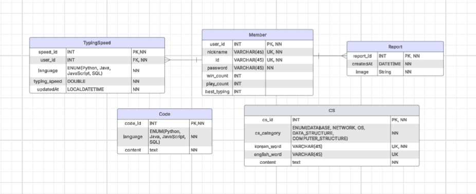
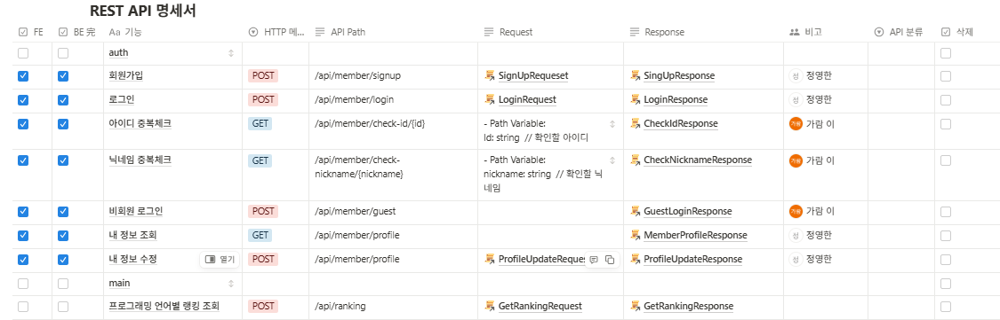
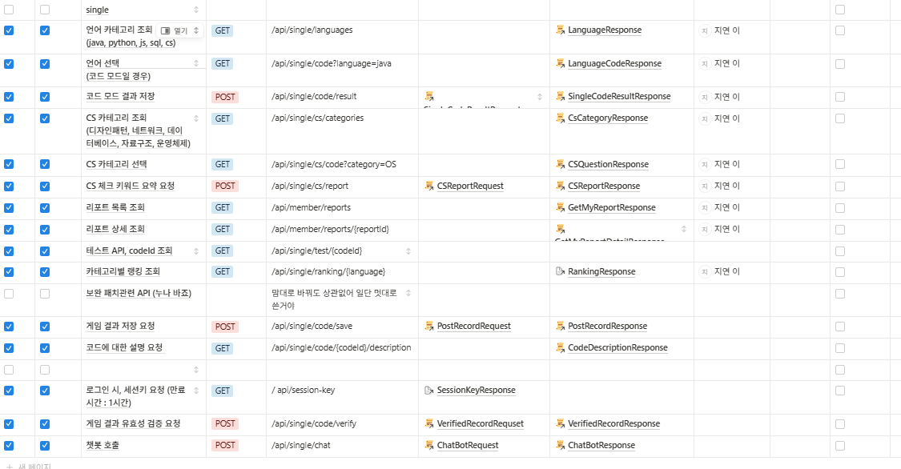
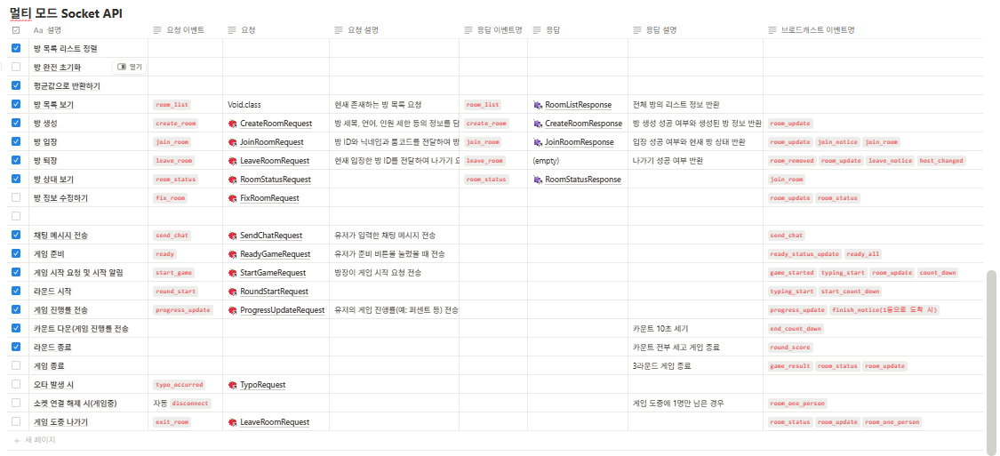
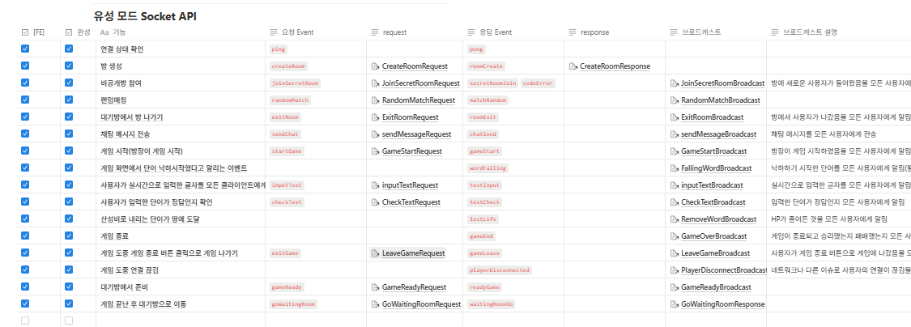
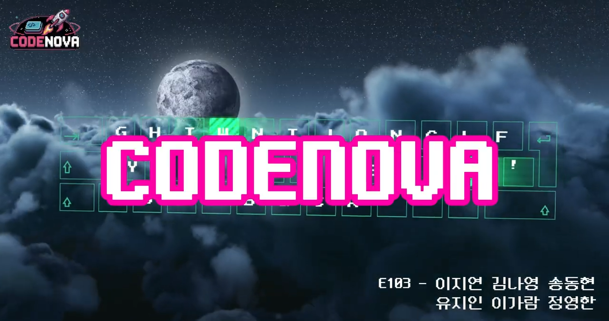

# 코딩 기반 실전 타자 게임 플랫폼 CODENOVW

### 📚 목차
- [✨ 프로젝트 소개](#-프로젝트-소개)
- [💡 기획 배경](#-기획-배경)
- [👫 대상](#-대상)
- [🎉 기대 효과](#-기대-효과)
- [🔉 주요 기능](#-주요-기능)
- [🗓️ 프로젝트 진행과정](#-프로젝트-진행과정)
- [🔧 기술 스택](#-기술-스택)
- [👥 팀원 소개](#-팀원-소개-및-역할-분담)
- [📁 프로젝트 산출물](#-프로젝트-산출물)
- [🖥️ 서비스 화면](#-서비스-화면)
- [😝 프로젝트 회고](#-프로젝트-회고)

## ✨ 프로젝트 소개
CodeNova는 단순한 코딩 게임이 아닙니다.
저희는 '재미', '성장', '경쟁', '학습' 이 네 가지 요소가 자연스럽게 어우러진 플랫폼을 만들고자 했습니다.

사용자들은 세 가지 주요 모드를 통해 몰입하면서 실력을 키울 수 있습니다:

- **싱글 모드**: 혼자서 실력을 키우는 공간입니다.
실제 코딩 문법 기반 문제를 입력하고, 게임 종료 후에는 자신의 최고 기록이 랭킹에 등록됩니다.
타이핑한 코드를 다시 확인하고, AI 챗봇에게 궁금한 점을 질문할 수 있는 기능도 포함되어 있습니다.

- **멀티 모드**: 최대 4명이 실시간으로 대결하는 코드 배틀입니다.
동일한 문제를 입력하고 누가 더 빠르고 정확하게 제출하는지 겨루는 구조로, 실제 코딩 감각을 경쟁 속에서 즐겁게 테스트할 수 있습니다.

- **유성 모드**: 협력 기반의 콘텐츠입니다.
최대 4명이 한 팀이 되어 하늘에서 떨어지는 유성 단어들을 함께 타이핑하여 방어합니다.
팀원 간 역할 분담과 협업이 핵심이며, 생존을 위해 소통과 정확도가 필수입니다.

## 💡 기획 배경
SSAFY 프로젝트에서는 높은 완성도를 지닌 결과물이 많았지만, 실제 사용자 피드백이나 활용 사례는 거의 없었습니다.
저희는 이를 넘어서 실제 사용자 200명을 확보하고, 그들이 직접 사용하도록 만드는 것을 목표로 삼았습니다.

최근 개발 환경에서는 자동완성이나 AI 기능에 대한 의존도가 커지고 있지만, 저희는 **직접 타이핑하며 손으로 익히는 감각**이 중요하다고 생각했습니다.

때문에 저희는 SSAFY인들 또는 개발을 공부하고 계시는 분들이 
- ✔️ 재미있게 즐기고
- ✔️ 자연스럽게 코딩 감각을 기르며
- ✔️ 몰입을 통해 실력을 축적할 수 있는

환경을 만들기 위해 CodeNova를 설계했습니다

## 👫 대상
- SSAFY 교육생을 비롯한 초급~중급 개발자
- 코딩 실력을 재미있게 키우고 싶은 분
- 타이핑을 통해 코딩 감각과 속도를 향상시키고 싶은 학습자
- 친구, 동료들과 실시간으로 코드 배틀을 즐기고 싶은 사용자
 
## 🎉 기대 효과
- 반복적인 타이핑 훈련을 통해 코딩 감각을 손에 익힐 수 있습니다.
- 실시간 경쟁과 협력을 통해 몰입도 높은 학습 경험을 제공합니다.
- 다양한 모드를 통해 자연스럽게 실력 향상과 동기 부여를 유도합니다.
- AI 기반 코드 해설과 챗봇 대화를 통해 학습 보조 효과도 얻을 수 있습니다.

## 🔉 주요 기능

### 🎮 싱글 모드

- 혼자서 타이핑 실력을 기를 수 있는 기본 모드
- 실제 문법 기반 코드 타이핑 → 결과 자동 랭킹 등록
- 코드 복습 기능 + AI 챗봇을 통한 코드 해설 제공

### ⚔️ 멀티 모드

- 2~4인이 함께 즐기는 실시간 코드 배틀
- 동일한 문제를 타이핑하며 정확도 + 속도로 승부
- 경쟁을 통한 코딩 실력 향상

### ☄️ 유성 모드 (협력 모드)

- 최대 4인 팀이 되어 하늘에서 떨어지는 단어를 막는 협동 콘텐츠
- 역할 분담 및 협업 타이핑 → 집중력과 팀워크 강화

### 🔐 보안 & 공정성 기능

- 매크로 방지 키로그 분석, 포커스 감지 및 모니터링
- 공정한 랭킹 시스템을 위한 비정상 입력 탐지 로직 적용

## 🗓️ 프로젝트 진행과정
SSAFY 12기 2학기 자율 프로젝트  
개발기간: 2025.04.14 ~ 2024.04.21

## 🔧 기술 스택

### 백엔드
   

### 프론트엔드
 
  

### 인프라
   
 
 
 
 
 

### 커뮤니케이션
    
  

## 👥 팀원 소개 및 역할 분담

<table >
    <thead>
        <tr>
            <th align="center">이지연(팀장) - BE, infra</th>
            <th align="center">정영한 - BE</th>
            <th align="center">이가람 - BE</th>
        </tr>
    </thead>
    <tbody>
        <td align="center">
            
        </td>
        <td align="center">
            
        </td>
        <td align="center">
            
        </td>
    </tbody>
</table>
<table >
    <thead>
        <tr>
            <th align="center">김나영 - FE</th>
            <th align="center">유지인 - FE</th>
            <th align="center">송동현 - FE</th>
        </tr>
    </thead>
    <tbody>
        <td align="center">
            
        </td>
        <td align="center">
            
        </td>
        <td align="center">
            
        </td>
    </tbody>
</table>

해당 프로필 사진을 클릭하면 해당 팀원의 깃허브로 이동합니다.

## 📁 프로젝트 산출물 

  
ERD

  

  
API 명세서

  <h3>AUTH API</h3>
  
   

  <h3>싱글 API</h3> 
  
   
  
  <h3>멀티 API</h3>  
  
   

  <h3>유성 API</h3>
  
   

  
아키텍처

  

  
UCC

  
   
  <a href="https://www.youtube.com/watch?v=H6nqYdognwc">UCC 바로가기</a>

## 🖥️ 서비스 화면

### 🎮 싱글 모드
- 혼자서 게임을 즐길 수 있는 모드입니다. 제한 시간 내 최대한 빠르게 입력해 높은 점수를 노려보세요!

---

### 👯‍♂️ 멀티 모드
- 다른 사용자와 실시간으로 대결하는 모드입니다. Socket.IO를 통해 실시간 입력 비교가 이루어집니다!

---

### 🌠 유성 모드
- 빠르게 떨어지는 CS 단어를 입력하여 바닥으로 떨어지는 모드입니다. 긴장감 넘치는 타자 경험을 제공합니다!

## 😝 프로젝트 회고
#### 😎 이지연

#### 😎 정영한

#### 😎 이가람

#### 😎 김나영

#### 😎 유지인

#### 😎 송동현

